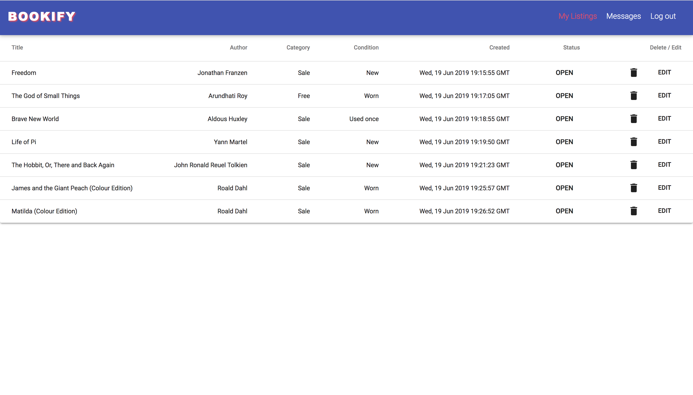

# Bookify :blue_book: :closed_book: :orange_book:

**An online platform for bibliophiles to turn their bookshelf into a personal library / bookstore.**

- **API** built with Ruby on Rails, Serializer and JWT Auth.
- **WebApp** built with React.
- Written in ES6 (Client).
- Written with Ruby on Rails (API).

## Features

- User authentication using JSON Web Tokens
- Database migration and seeding
- Styling using MDBReact with custom CSS
- Ruby on Rails schema with associations
- Navigational components with React Router
- Utilisation of Google Books API and Google Maps API
- Hosted on Heroku at https://b-ookify.herokuapp.com/

## Setup

- Dependencies:
  - Yarn version v1.16.0
  - Node v11.11.0

## Screenshots

